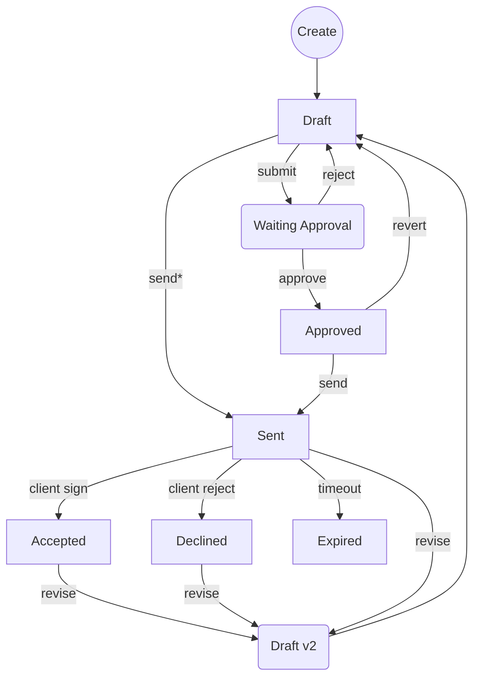

# Estimate Lifecycle & Data Safety Model

This document outlines the complete lifecycle of an estimate within the application, defining states, transitions, ownership rules, and safety mechanisms designed to prevent data loss or corruption.

## 1. Core Philosophy: "Safe by Design"

The system adheres to three core data safety principles:
1.  **Immutability of History**: Once an estimate is shared (Sent) or agreed upon (Accepted), its content is frozen. Any subsequent change creates a *new version*.
2.  **Recoverability**: No line item or section is ever permanently deleted by a user action. `SoftDeletes` allow for recovery of accidental removal.
3.  **Concurrency Safety**: Optimistic locking prevents users from silently overwriting each other's work.

---

## 2. Estimate States & Transitions

### State Definitions

| State | Status Code | Description | Editability |
| :--- | :--- | :--- | :--- |
| **Draft** | `draft` | Initial workspace. Work in progress. | **Mutable** (Owner & Collaborators) |
| **Review** | `waiting_approval` | Submitted to internal management. | **Locked** for Owner; **Mutable** for Approvers. |
| **Approved** | `approved` | Internal checks passed. Ready for client. | **Locked** (Must "Revert to Draft" to edit). |
| **Sent** | `sent` | Emailed/Viewed by Client. Legal snapshot. | **Immutable**. Editing triggers **Versioning**. |
| **Accepted** | `accepted` | Client signed/approved. Binding contract. | **Immutable**. Editing triggers **Versioning**. |
| **Declined** | `declined` | Client rejected. | **Immutable**. Editing triggers **Versioning**. |
| **Expired** | `expired` | Validity date passed. | **Immutable**. Editing triggers **Versioning**. |

### State Transition Diagram

*\* Direct send allowed if no approval chain matches.*

---

## 3. Versioning & "Fork-on-Write"

To solve the conflict between "Clients need a stable record" and "Negotiations require changes", the system uses a **Fork-on-Write** model for finalized estimates.

### The Rule
> "If a user attempts to edit an estimate that is `SENT`, `ACCEPTED`, `DECLINED`, or `EXPIRED`, the system **automatically** creates a new version (e.g., `Estimate #1001-v2`), copies all data to it, and applies the edits to the new draft."

### Behavior Matrix

| Current Status | Action | System Response |
| :--- | :--- | :--- |
| **Draft** | Edit | Updates record directly. |
| **Waiting Approval** | Edit | **Blocked**. Must withdraw/reject first. |
| **Sent** | Edit | **Fork**. Creates `v(n+1)` as Draft. Redirects user. |
| **Accepted** | Edit | **Fork**. Creates `v(n+1)` as Draft. Redirects user. |
| **Any** | Edit (Concurrent) | **Blocked**. Optimistic Lock measures timestamp diff. |

---

## 4. Ownership & Edit Rules

### Roles
1.  **Creator**: The user who started the estimate.
2.  **Collaborator**: A user added as a follower/editor (or Admin).
3.  **Approver**: A user designated by the Approval Chain (e.g., Sales Manager).

### Permissions Table

| Role | Draft | Waiting Approval | Sent/Finalized |
| :--- | :--- | :--- | :--- |
| **Creator** | ✅ Full Edit | ❌ Read Only | ❌ Read Only (Triggers Fork) |
| **Collaborator** | ✅ Full Edit | ❌ Read Only | ❌ Read Only (Triggers Fork) |
| **Approver** | ❌ Read Only | ✅ Edit (if current step) | ❌ Read Only |
| **Admin** | ✅ Full Edit | ✅ Override | ❌ Read Only (Triggers Fork) |

---

## 5. Failure & Recovery Scenarios

The system is designed to handle common failure modes gracefully.

| Scenario | Risk | Protection Mechanism |
| :--- | :--- | :--- |
| **Network Failure during Save** | Partial data written (corruption). | **Database Transactions**. Updates are atomic; either all save or none save. |
| **Accidental Item Deletion** | User mistakenly removes a row. | **Soft Deletes**. Line items remain in DB with `deleted_at`. Admin can restore. |
| **Concurrent Editing** | Two users edit same draft. | **Optimistic Locking**. The second save is rejected with a "Stale Data" warning. |
| **Browser Crash** | Unsaved form data lost. | **Local Storage Autosave** (Frontend - *Recommended Implementation*). |
| **Logic Error (Code)** | Incorrect total calculation. | **Server-Side Recalculation**. Totals are re-computed from line items on every save. |

## 6. Audit Trail

Every major action is logged to the `ActivityLog` to ensure accountability:
*   **Status Changes**: Who changed it, from what to what.
*   **Edits**: "Estimate updated by [User]".
*   **Branching**: "Created revision v2 from locked estimate #..."
*   **Sending**: "Sent to client [Email] by [User]".

---

## Implementation Summary (Technical)

*   **Models**: `Estimate`, `EstimateItem` (SoftDeletes), `EstimateSection` (SoftDeletes).
*   **Controller**: `EstimateController@update` implements the Branching Logic and Optimistic Locking.
*   **Frontend**: `edit.blade.php` passes `last_update_timestamp` for concurrency checks.
*   **Policy**: `EstimatePolicy` enforces the high-level role permissions.
